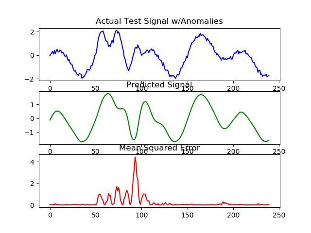

# Using an LSTM and Other Algorithms for Unsupervised Anomaly Detection

Using an LSTM (Long Short-Term Memory) algorithm on synthetic time series data for unsupervised anomaly detection.  It uses the Mean Squared Error as a measure of outliers in this type of data. 

Diagram of original signal, smoothed signal and anomaly detection via MSE.

Some TODO:
- [x] Keras (TF backend)
- [ ] Estimates on real-world data (e.g. [this Kaggle rain dataset](https://www.kaggle.com/c/how-much-did-it-rain-ii/data))
- [ ] PyTorch port

Other Approaches:
- [ ] Finite state automaton with state transitions for time series data segmentation ([Ref](https://www.researchgate.net/publication/220204638_Learning_States_and_Rules_for_Detecting_Anomalies_in_Time_Series?_sg=wtAtrT6qNOh-plUIkp9zbG3ENZac6c7kXN_WJaNHgal02MbaRuNof8kSy8_uOg0rOLLIo8PhGQ))
- [ ] One-class NN ([Code](https://github.com/raghavchalapathy/oc-nn))
- [ ] TBD

## References

1.  https://github.com/aurotripathy/lstm-anomaly-detect
2.  https://github.com/Vict0rSch/deep_learning/tree/master/keras/recurrent
3.  http://simaaron.github.io/Estimating-rainfall-from-weather-radar-readings-using-recurrent-neural-networks/
4.  https://github.com/khundman/telemanom/tree/no-labels
